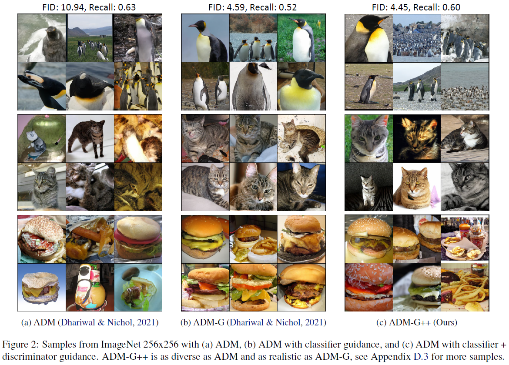

## Refining Generative Process with Discriminator Guidance in Score-based Diffusion Models (DG) (under review) <br><sub>Official PyTorch implementation of the Discriminator Guidance </sub>
**[Dongjun Kim](https://sites.google.com/view/dongjun-kim) \*, [Yeongmin Kim](https://sites.google.com/view/yeongmin-space/%ED%99%88) \*, Se Jung Kwon, Wanmo Kang, and Il-Chul Moon**   
<sup> * Equal contribution </sup> <br>

| [paper](https://arxiv.org/abs/2211.17091) |  <br>
**Camera-ready final version will be released within this month. Stay tuned!** <br>
**See [https://github.com/alsdudrla10/DG](https://github.com/alsdudrla10/DG) for the Cifar-10 code release.** <br>

## Overview


## Step-by-Step running of Discriminator Guidance

### 1) Fake sample generation
  - Run:
  ```
  python3 sample.py --LT_cfg=1.5 --ST_cfg=1.5 --time_min=1000
   ```
### 2) Prepare real data
  - Place real data at the directory specified.
  ```
  ${project_page}/DG_imagenet/data/
  ├── ImageNet2012
  │   ├── train
  │   │   ├── n01440764
  │   │   │   ├── n01440764_10026.JPEG
  │   │   │   ├── ...
  │   │   ├── ...
  │   ├── ...
  ├── ...
  ```

### 3) Latent extraction
  - We pre-compute and store latent values of real/generated data using the encoder of a pre-trained VAE model used in [DiT](https://github.com/facebookresearch/DiT).
  - Run:
  ```
  python3 data_tool.py
  ```

### 4) Prepare pretrained classifier
  - Download [DG_imagenet/pretrained_models/ADM_classifier/32x32_classifier.pt](https://drive.google.com/drive/folders/1yxjvfIW6HvLSJHACkC5-5U46Mny81SSI)
  - As the latent is 32x32x4-dimensional vector, we follow [ADM[(https://github.com/openai/guided-diffusion) to train a classifier for 32x32x4 inputs.

  - Place **32x32_classifier.pt** at the directory specified.
  ```
  ${project_page}/DG_imagenet/
  ├── pretrained_models
  │   ├── ADM_classifier/32x32_classifier.pt
  ├── ...
  ```

### 5) Discriminator training
  - Download pre-trained checkpoint [DG_imagenet/pretrained_models/discriminator/discriminator_7.pt](https://drive.google.com/drive/folders/1-2ytbvo7yG2X3Z65XNugBhPRKangvZgg) for the test.
  - Place **discriminator_7.pt** at the directory specified.
  ```
  ${project_page}/DG_imagenet/
  ├── pretrained_models
  │   ├── discriminator/discriminator_7.pt
  ├── ...
  ```
  - To train the discriminator from scratch, run:
  ```
  python3 train.py
  ```

### 6) Generation with Discriminator Guidance
  - Run:
  ```
  python3 sample.py
  ```

## Experimental Results

### Results on data diffusion
|FID-50k |ImageNet256|
|------------|------------|
|ADM|4.59|
|ADM-G++|3.18|

### Results on latent diffusion
|FID-50k|ImageNet256|
|------------|------------|
|DiT|2.27|
|DiT-G++|1.83|


### Samples from ADM


### Random samples from DiT-XL/2-G++ (FID=1.83)


## Reference
If you find the code useful for your research, please consider citing
```bib
@article{kim2022refining,
  title={Refining Generative Process with Discriminator Guidance in Score-based Diffusion Models},
  author={Kim, Dongjun and Kim, Yeongmin and Kang, Wanmo and Moon, Il-Chul},
  journal={arXiv preprint arXiv:2211.17091},
  year={2022}
}
```
This work is heavily built upon the code from
 - *Peebles, W., & Xie, S. (2022). Scalable Diffusion Models with Transformers. arXiv preprint arXiv:2212.09748.*
 - *Dhariwal, P., & Nichol, A. (2021). Diffusion models beat gans on image synthesis. Advances in Neural Information Processing Systems, 34, 8780-8794.*

